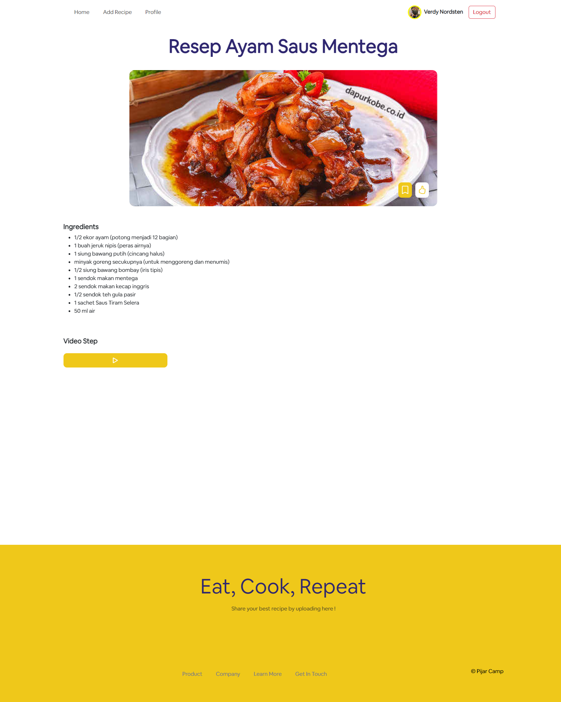
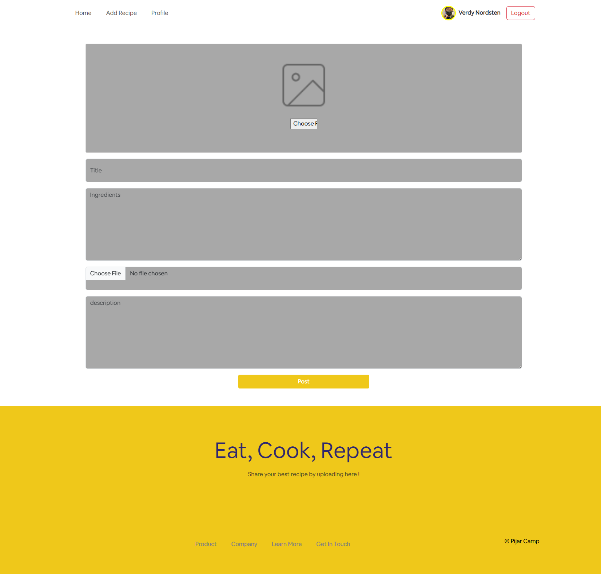
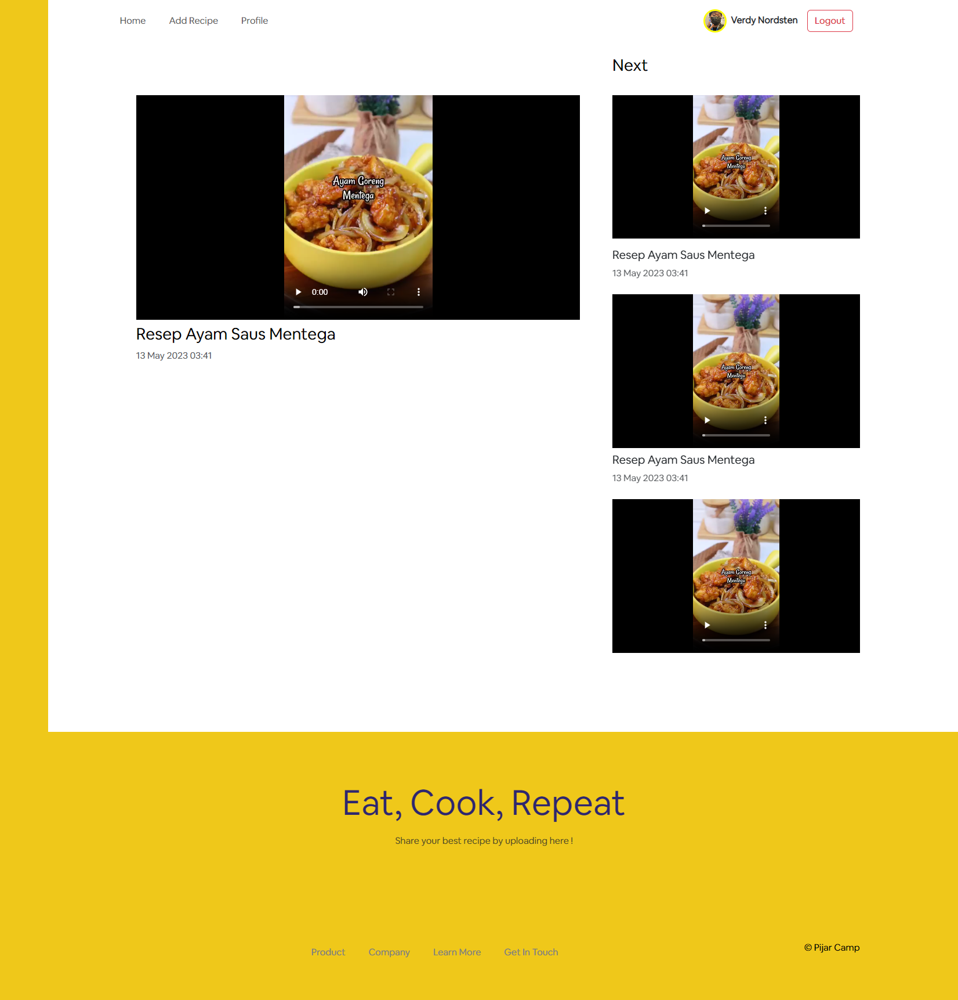
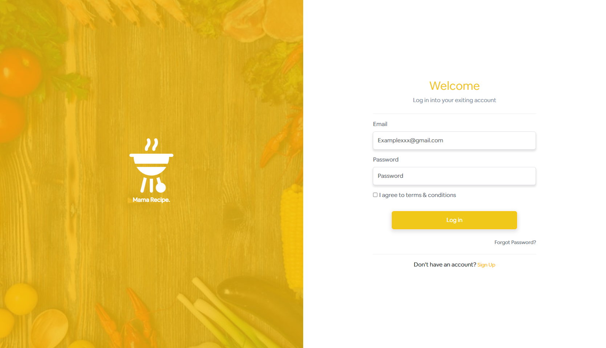
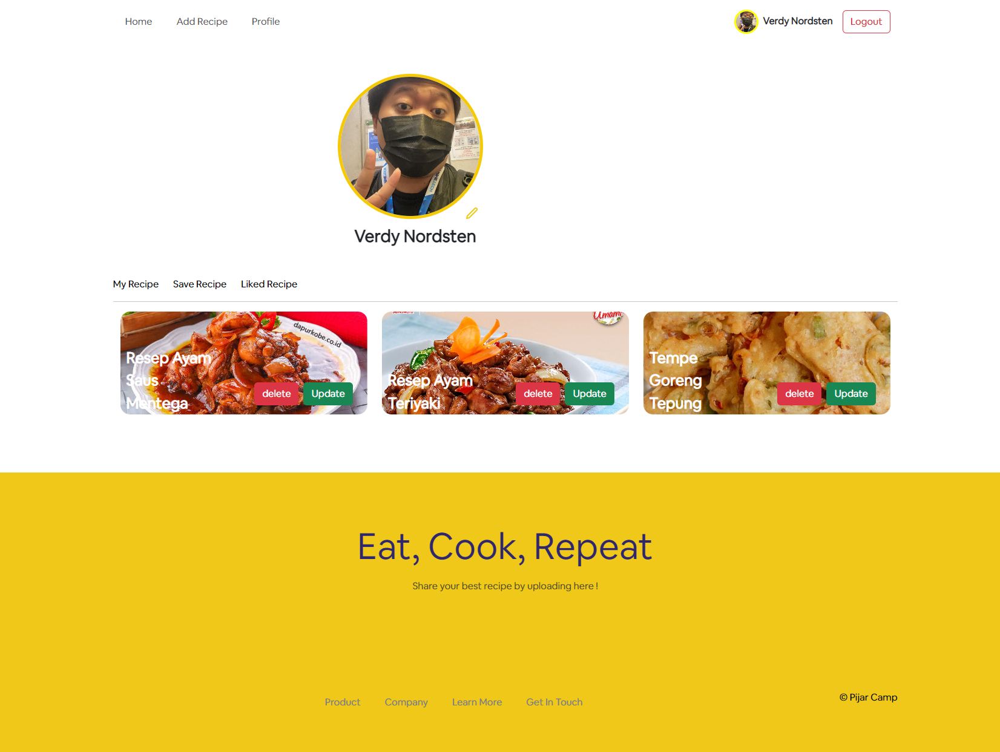

<p align="center">
<div align="center">
  
</div>
  <h3 align="center">Mama Recipe</h3>
  <p align="center">
    <a href="https://github.com/VerdyNordsten/izipizy-FE"><strong>Explore the docs »</strong></a>
    <br />
    <a href="https://mama-recipe-izipizy.vercel.app/">View Demo</a>
    ·
    <a href="https://izipizybackend-production.up.railway.app/">Api Demo</a>
  </p>
</p>

<!-- TABLE OF CONTENTS -->

## Table of Contents

- [Table of Contents](#table-of-contents)
- [About The Project](#about-the-project)
  - [Built With](#built-with)
- [Getting Started](#getting-started)
  - [Prerequisites](#prerequisites)
  - [Requirements](#requirements)
  - [Installation](#installation)
  - [Setup .env](#setup-env)
- [Screenshots](#screenshots)
- [Related Project](#related-project)
- [Meet Team](#team)

<!-- ABOUT THE PROJECT -->

## About The Project

Mama Recipe is a recipe food application designed to provide users with a wide variety of culinary inspirations and cooking ideas. The platform offers an extensive collection of recipes from diverse cuisines, allowing users to explore and prepare delicious meals in their own kitchens.

One of the standout features of Mama Recipe is its user-friendly interface, which makes it easy for users to search for specific recipes, browse by categories, or discover new dishes based on their preferences. From appetizers to desserts, Mama Recipe offers a diverse range of culinary delights to satisfy every taste.

Mama Recipe also provides detailed step-by-step instructions for each recipe, along with ingredient lists and cooking tips. This helps users follow along and recreate the dishes with confidence, even if they are new to cooking.

To use Mama Recipe, users can create an account or explore the app as a guest. The application also offers personalized recommendations based on users' cooking interests and dietary preferences, making it easier to find recipes that suit their individual needs.

With Mama Recipe, cooking becomes a delightful and rewarding experience, empowering users to create homemade meals that are both delicious and nourishing. Whether it's for everyday cooking or special occasions, Mama Recipe is a go-to app for culinary enthusiasts seeking inspiration in the kitchen.

<!-- GETTING STARTED -->

## Getting Started

### Prerequisites

This is an example of how to list things you need to use the software and how to install them.

- [nodejs](https://nodejs.org/en/download/)
- [Bootstrap Css](https://getbootstrap.com/)
- [React JS](https://react.dev/)

| Third Party        | npm install                 |
| ------------------ | --------------------------- |
| [@reduxjs/toolkit] | npm i @reduxjs/toolkit      |
| [aos]              | npm i aos                    |
| [axios]            | npm i axios                  |
| [bootstrap]        | npm i bootstrap              |
| [dotenv]           | npm i dotenv                 |
| [react]            | npm i react                  |
| [react-bootstrap]  | npm i react-bootstrap        |
| [react-dom]        | npm i react-dom              |
| [react-loader-spinner] | npm i react-loader-spinner |
| [react-persist]    | npm i react-persist          |
| [react-redux]      | npm i react-redux            |
| [react-router-dom] | npm i react-router-dom       |
| [react-scripts]    | npm i react-scripts          |
| [redux]            | npm i redux                  |
| [redux-logger]     | npm i redux-logger           |
| [redux-thunk]      | npm i redux-thunk            |
| [sweetalert2]      | npm i sweetalert2            |

[@reduxjs/toolkit]: https://www.npmjs.com/package/@reduxjs/toolkit
[aos]: https://www.npmjs.com/package/aos
[axios]: https://www.npmjs.com/package/axios
[bootstrap]: https://www.npmjs.com/package/bootstrap
[dotenv]: https://www.npmjs.com/package/dotenv
[react]: https://www.npmjs.com/package/react
[react-bootstrap]: https://www.npmjs.com/package/react-bootstrap
[react-dom]: https://www.npmjs.com/package/react-dom
[react-loader-spinner]: https://www.npmjs.com/package/react-loader-spinner
[react-persist]: https://www.npmjs.com/package/react-persist
[react-redux]: https://www.npmjs.com/package/react-redux
[react-router-dom]: https://www.npmjs.com/package/react-router-dom
[react-scripts]: https://www.npmjs.com/package/react-scripts
[redux]: https://www.npmjs.com/package/redux
[redux-logger]: https://www.npmjs.com/package/redux-logger
[redux-thunk]: https://www.npmjs.com/package/redux-thunk
[sweetalert2]: https://www.npmjs.com/package/sweetalert2

### Installation

- Clone This Front End Repo

```
git clone https://github.com/VerdyNordsten/izipizy-FE
```

- Go To Folder Repo

```
cd izipizy-FE
```

- Install Module

```
npm install
```

- <a href="#setup-env">Setup .env</a>
- Type ` npm run dev` To Start Website
- Type ` npm run production` To Start Production

### Setup .env

Create .env file in your root project folder.

```
REACT_APP_BACKEND = [BACKEND_URL]
```

<!-- ROADMAP -->

## Screenshots

<table>
<div align="center">
  <tr>
    <td></td>
  </tr>
  <tr>
    <td>Home Page</td>
  </tr>
  <tr>
    <td> </td>
  </tr>
  <tr>
    <td>Detail Recipe</td>
  </tr>
  <tr>
    <td> </td>
  </tr>
  <tr>
    <td>Add Recipe</td>
  </tr>
  <tr>
    <td> </td>
  </tr>
  <tr>
    <td>Video Recipe</td>
  </tr>
  <tr>
    <td> </td>
  </tr>
  <tr>
    <td>Login</td>
  </tr>
  <tr>
    <td> </td>
  </tr>
  <tr>
    <td>Register</td>
  </tr>
  <tr>
    <td> </td>
  </tr>
  <tr>
    <td>My Profile</td>
  </tr>
</div>
</table>

## Related Project

:rocket: [`Backend Mama Recipe`](https://github.com/VerdyNordsten/izipizy_backend)

:rocket: [`Frontend Mama Recipe`](https://github.com/VerdyNordsten/izipizy-FE)

:rocket: [`Demo Mama Recipe`](https://mama-recipe-izipizy.vercel.app/)

Project Link: [https://github.com/VerdyNordsten/izipizy_backend](https://github.com/VerdyNordsten/izipizy_backend)

## Meet Team

<center>
  <table align="center">
    <tr >
    <th >Frontend Developer / Product Manager</th>
      <th >Frontend Developer</th>
      <th >Frontend Developer</th>
      <th >Backend Developer</th>
      <th >Backend Developer</th>
    </tr>
    <tr >
      <td align="center">
        <a href="https://github.com/hosealeonardo18">
          <br/>
          <b>Hose Leonardo</b>
        </a>
      </td>
      <td align="center">
        <a href="https://github.com/preedok">
          <br/>
          <b>Muhamad Iqbal Aprido</b>
        </a>
      </td>
      <td align="center">
        <a href="https://github.com/Shaniara28">
          <br/>
          <b>Shania Riski Agustin</b>
        </a>
      </td>
      <td align="center">
        <a href="https://github.com/RezaldhoArmadhani">
          <br/>
          <b>Rezaldho Armadani</b>
        </a>
      </td>
      <td align="center">
        <a href="https://github.com/VerdyNordsten">
          <br/>
          <b>Verdy Prido Lugara</b>
        </a>
      </td>
    </tr>
  </table>
</center>